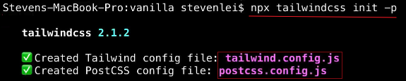
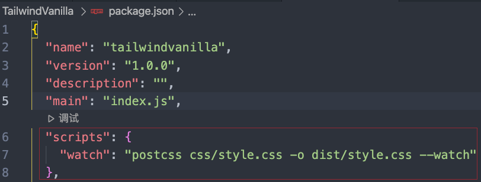
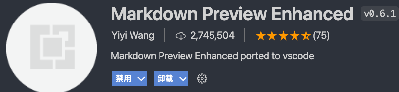

---

# iconfont unicode 引用
```
unicode是字体在网页端最原始的应用方式，特点是：

兼容性最好，支持ie6+，及所有现代浏览器。
支持按字体的方式去动态调整图标大小，颜色等等。
但是因为是字体，所以不支持多色。只能使用平台里单色的图标，就算项目里有多色图标也会自动去色。
注意：新版iconfont支持多色图标，这些多色图标在unicode模式下将不能使用，如果有需求建议使用symbol的引用方式

unicode使用步骤如下：

第一步：拷贝项目下面生成的font-face
@font-face {font-family: 'iconfont';
    src: url('iconfont.eot');
    src: url('iconfont.eot?#iefix') format('embedded-opentype'),
    url('iconfont.woff') format('woff'),
    url('iconfont.ttf') format('truetype'),
    url('iconfont.svg#iconfont') format('svg');
}

第二步：定义使用iconfont的样式
.iconfont{
    font-family:"iconfont" !important;
    font-size:16px;font-style:normal;
    -webkit-font-smoothing: antialiased;
    -webkit-text-stroke-width: 0.2px;
    -moz-osx-font-smoothing: grayscale;}
第三步：挑选相应图标并获取字体编码，应用于页面
<i class="iconfont">&#x33;</i>
```

# BEM规范
```
BLOCK
BLOCK--MODIFIER
BLOCK__ELEMENT
BLOCK__ELEMENT--MODIFIER
```

使用 BEM 命名规范，理论上讲，每行 css 代码都只有一个选择器。
BEM代表 “块（block）,元素（element）,修饰符（modifier）”,我们常用这三个实体开发组件。
在选择器中，由以下三种符号来表示扩展的关系：
```
- 中划线 ：仅作为连字符使用，表示某个块或者某个子元素的多单词之间的连接记号。
-- 双中划线线：用来描述一个块或者块的子元素的一种状态
__ 双下划线：双下划线用来连接块和块的子元素

type-block__element--modifier
```
### 块(block)

一个块是设计或布局的一部分，它有具体且唯一地意义 ，要么是语义上的要么是视觉上的。

在大多数情况下，任何独立的页面元素（或复杂或简单）都可以被视作一个块。它的HTML容器会有一个唯一的CSS类名，也就是这个块的名字。

针对块的CSS类名会加一些前缀（ ui-），这些前缀在CSS中有类似 命名空间 的作用。

一个块的正式（实际上是半正式的）定义有下面三个基本原则：

CSS中只能使用类名（不能是ID）。
每一个块名应该有一个命名空间（前缀）
每一条CSS规则必须属于一个块。

### 元素(element)

块中的子元素是块的子元素，并且子元素的子元素在 bem 里也被认为是块的直接子元素。一个块中元素的类名必须用父级块的名称作为前缀。

### 修饰符(modifier)

一个“修饰符”可以理解为一个块的特定状态，标识着它持有一个特定的属性。

用一个例子来解释最好不过了。一个表示按钮的块默认有三个大小：小，中，大。为了避免创建三个不同的块，最好是在块上加修饰符。这个修饰符应该有个名字（比如：size ）和值（ small，normal 或者 big ）。

---
## VueCLI4-Vue2配置ElementUI
1. npm i element-ui -S
2. npm install babel-plugin-component -D
3. babel.config.js添加
   ```js
   module.exports = {
      presets: [
         '@vue/cli-plugin-babel/preset'
      ],
      "plugins": [
         [
            "component",
            {
            "libraryName": "element-ui",
            "styleLibraryName": "theme-chalk"
            }
         ]
      ]
   }
   ```
4. main.js 添加 按需引入
   ```js
   import { Button, Message } from 'element-ui';

   Vue.component(Button.name, Button);
   Vue.prototype.$message = Message;
   ```
- 另一种配置是：vue add element 插件方式引入，版本可能比较旧
---
# TailwindCSS 配置
### 原生_v2
1. npm init -y
2. npm install -D tailwindcss@2 postcss postcss-cli autoprefixer
3. npx tailwindcss init -p
   
4. 创建css，注入Tailwind
   ```css
    @tailwind base;
    @tailwind components;
    @tailwind utilities;
   ```
   
5. package.json添加
   ```json
   "scripts": {
     "watch": "postcss main.css -o dist/style.css --watch"
   },
   ```
   
6. npm run watch  生成dist目录下的style.css
   
7. 配置tailwind.config.js, purge编写会用到tailwind的文件
   ```
   module.exports = {
      purge: [
        './dist/**/*.html'
      ],
      darkMode: false, // or 'media' or 'class'
      theme: {
        extend: {},
      },
      variants: {
        extend: {},
      },
      plugins: [],
   }
   ```
8. package.json添加生产环境script
   ```json
   "scripts": {
      "watch": "postcss css/style.css -o dist/style.css --watch",
      "build": "NODE_ENV=production postcss css/style.css -o dist/style.css"
   }
   ```
   
---
# Vue-CLI-Vue3 配置tailwindcss_v2 20220225
1. vue create [vue3App]
2. npm install -D tailwindcss@npm:@tailwindcss/postcss7-compat postcss@^7 autoprefixer@^9
3. npx tailwindcss init -p 创建tailwind和postcss配置文件
4. src目录下创建tailwind.css
   ```css
    @tailwind base;
    @tailwind components;
    @tailwind utilities;
   ```
5. main.js中引入css
   
6. App.vue编辑做测试
7. 生产优化，build时删减tailwind多余代码，配置编辑tailwind.config.js
   ```js
    module.exports = {
      purge: [
        './src/**/*.html',
        './src/**/*.vue',
        './src/**/*.jsx',
      ],
      darkMode: false, // or 'media' or 'class'
      theme: {
        extend: {},
      },
      variants: {
        extend: {},
      },
      plugins: [],
    }
   ```
## Vue3 配置 Element Plus
1. npm install element-plus --save
2. main.js中添加
   ```
   import ElementPlus from 'element-plus'
   import 'element-plus/dist/index.css'

   createApp(App).use(ElementPlus).mount('#app')
   ```
3. App.vue测试组件

---
## Tailwindcss_v3 postcss-cli配置
1. npm init -y
2. npm install -D tailwindcss postcss-cli autoprefixer
3. npx tailwindcss init -p
4. 配置tailwind.config.js
   ```js
   module.exports = {
      content: ['./src/**/*.html'],
      theme: {
         extend: {},
      },
      plugins: [],
   }
   ```
5. 根目录下创建tailwind.css
   ```css
   @tailwind base;
   @tailwind components;
   @tailwind utilities;
   ```
6. package.json添加script
   npm i cross-env -S
   ```
   "dev": "TAILWIND_MODE=WATCH postcss tailwind.css -o ./layouts/css/style.css --watch --verbose",
   "build": "NODE_ENV=production postcss tailwind.css -o ./layouts/css/style.css"
   ```
7. npm run dev
8. npm i cssnano -D, postcss代码压缩插件
9. postcss.config.js 生产环境、压缩代码配置
   ```js
   module.exports = {
      plugins: {
      tailwindcss: {},
      autoprefixer: {},
      ...(process.env.NODE_ENV === 'production' ? { cssnano: {} } : {})
      }
   }
   ```
10. npm run build
# vscode-markdown配置
>参考视频：[bilibili](https://www.bilibili.com/video/BV1si4y1472o?from=search&seid=9129748802042065742)





- vscode设置内搜‘paste image'设置图片存放路径
  
