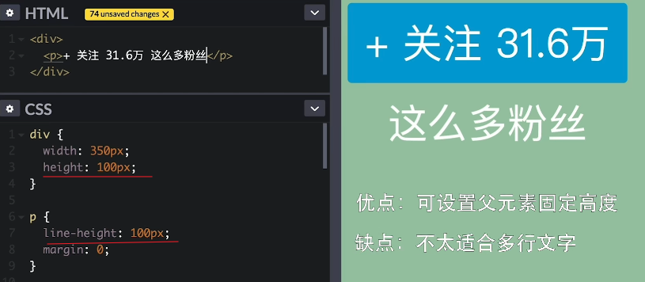
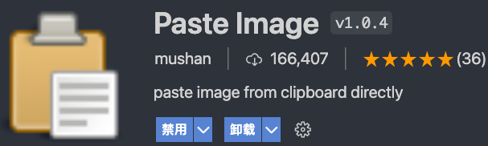

# HTML-snippet


# CSS-snippet
## 清除浮动clearfix(高度塌陷的父元素食用)，以及解决外边距合并
```css
.clearfix::after,
.clearfix::before {
  content: '';
  display: table;
  clear: both
}
```
- display: flow-root，不支持Safari。它可以创建无副作用的BFC。在父级块中使用 display: flow-root 可以创建新的BFC。其作用和clearfix一致。
- display: flow-root似乎还解决了margin-top外边距塌陷的问题

## 解决margin-top传递现象
  - 子元素改用padding-top
  - 父容器添加border-top: 1px solid transparent

## 方形切角效果 子绝父相
```css
&__tag {
    position: relative;
    /* 父元素宽 */
    width: 155px;
    height: 72px;
    background: #f34949;
    margin: 0 auto;
  }
  &__tag-cut {
    position: absolute;
    bottom: 0;
    /* 父元素宽度一半 */
    border-left: 78px solid transparent;
    border-right: 78px solid transparent;
    /* 10px指切角高度 */
    border-bottom: 10px solid #fff;
  }
```


# 垂直居中
1. 子绝父相 子元素垂直居中
    ```css
    {
      position: absolute;
      top: 50%;
      left: 50%;
      transform: translate(-50%, -50%);
    }
    ```
2. ul li table表格
   
3. flex 除开兼容性，最适合
   
4. grid 比较适合多行多列
   
5. 伪元素 vertical-align: middle
   
6. 父元素设置上下padding
   
7. line-height
   
# 水平居中
1. text-align: center
   
   
2. float浮动
   
## 等高布局
1. display: table
   
2. flex
   
3. grid
   
4. 兼容写法
   
## calc()应用场景
1. 图片垂直水平居中
   
2. 最小外边距
   
3. 两栏布局
   
## 单行溢出文本省略号
```css
{
  text-overflow: ellipsis;
  overflow: hidden;
  white-space: nowrap;
}
```

## 上下左右 箭头 >
```
<i class="arrow-down"></i>
.arrow-down{
  display: inline-block;
  border: 1px solid #000;
  border-width: 0 1px 1px 0;
  padding: 5px;
  <!-- -135上, 45下, 135左, -45右 -->
  transform: rotate(45deg);
}
```
## 圆点导航ul-li实现
```css
<ul>
	<li><a href=""></a></li>
	<li><a href=""></a></li>
	<li><a href=""></a></li>
</ul>

li {
	margin-left: 10px;
	list-style: none;
	float: left;
	width: 10px;
	height: 10px;
	background: #999;
	border-radius: 50%;
}
```

## 图片水平居中 - img { margin: 0 auto}不生效
- img是inline元素
```
img { display: block}
```

## BFC触发条件
- float的值不是none
- position的值不是static或者relative
- display的值是inline-block、table-cell、flex、table-caption或者inline-flex
- overflow的值不是visible
>在现代布局flex和grid中，是默认自带BFC规范的，所以可以解决非BFC盒子的一些问题，这就是为什么flex和grid能成为更好的布局方式原因之一。

## box-sizing


# JS-snippet

---

# iconfont unicode 引用
```
unicode是字体在网页端最原始的应用方式，特点是：

兼容性最好，支持ie6+，及所有现代浏览器。
支持按字体的方式去动态调整图标大小，颜色等等。
但是因为是字体，所以不支持多色。只能使用平台里单色的图标，就算项目里有多色图标也会自动去色。
注意：新版iconfont支持多色图标，这些多色图标在unicode模式下将不能使用，如果有需求建议使用symbol的引用方式

unicode使用步骤如下：

第一步：拷贝项目下面生成的font-face
@font-face {font-family: 'iconfont';
    src: url('iconfont.eot');
    src: url('iconfont.eot?#iefix') format('embedded-opentype'),
    url('iconfont.woff') format('woff'),
    url('iconfont.ttf') format('truetype'),
    url('iconfont.svg#iconfont') format('svg');
}

第二步：定义使用iconfont的样式
.iconfont{
    font-family:"iconfont" !important;
    font-size:16px;font-style:normal;
    -webkit-font-smoothing: antialiased;
    -webkit-text-stroke-width: 0.2px;
    -moz-osx-font-smoothing: grayscale;}
第三步：挑选相应图标并获取字体编码，应用于页面
<i class="iconfont">&#x33;</i>
```

# BEM规范
```
BLOCK
BLOCK--MODIFIER
BLOCK__ELEMENT
BLOCK__ELEMENT--MODIFIER
```

使用 BEM 命名规范，理论上讲，每行 css 代码都只有一个选择器。
BEM代表 “块（block）,元素（element）,修饰符（modifier）”,我们常用这三个实体开发组件。
在选择器中，由以下三种符号来表示扩展的关系：
```
- 中划线 ：仅作为连字符使用，表示某个块或者某个子元素的多单词之间的连接记号。
-- 双中划线线：用来描述一个块或者块的子元素的一种状态
__ 双下划线：双下划线用来连接块和块的子元素

type-block__element--modifier
```
### 块(block)

一个块是设计或布局的一部分，它有具体且唯一地意义 ，要么是语义上的要么是视觉上的。

在大多数情况下，任何独立的页面元素（或复杂或简单）都可以被视作一个块。它的HTML容器会有一个唯一的CSS类名，也就是这个块的名字。

针对块的CSS类名会加一些前缀（ ui-），这些前缀在CSS中有类似 命名空间 的作用。

一个块的正式（实际上是半正式的）定义有下面三个基本原则：

CSS中只能使用类名（不能是ID）。
每一个块名应该有一个命名空间（前缀）
每一条CSS规则必须属于一个块。

### 元素(element)

块中的子元素是块的子元素，并且子元素的子元素在 bem 里也被认为是块的直接子元素。一个块中元素的类名必须用父级块的名称作为前缀。

### 修饰符(modifier)

一个“修饰符”可以理解为一个块的特定状态，标识着它持有一个特定的属性。

用一个例子来解释最好不过了。一个表示按钮的块默认有三个大小：小，中，大。为了避免创建三个不同的块，最好是在块上加修饰符。这个修饰符应该有个名字（比如：size ）和值（ small，normal 或者 big ）。

---
# TailwindCSS 配置
### 原生
1. npm init -y
2. npm install -D tailwindcss@2 postcss postcss-cli autoprefixer
3. npx tailwindcss init -p
   
4. 创建css，注入Tailwind
   ```css
    @tailwind base;
    @tailwind components;
    @tailwind utilities;
   ```
   
5. package.json添加
   ```json
   "scripts": {
     "watch": "postcss main.css -o dist/style.css --watch"
   },
   ```
   
6. npm run watch  生成dist目录下的style.css
   
7. 配置tailwind.config.js, purge编写会用到tailwind的文件
   ```
   module.exports = {
      purge: [
        './dist/**/*.html'
      ],
      darkMode: false, // or 'media' or 'class'
      theme: {
        extend: {},
      },
      variants: {
        extend: {},
      },
      plugins: [],
   }
   ```
8. package.json添加生产环境script
   ```json
   "scripts": {
      "watch": "postcss css/style.css -o dist/style.css --watch",
      "build": "NODE_ENV=production postcss css/style.css -o dist/style.css"
   }
   ```

---
# Vue-CLI-Vue3 配置tailwind 20220225
1. vue create [vue3App]
2. npm install -D tailwindcss@npm:@tailwindcss/postcss7-compat postcss@^7 autoprefixer@^9
3. npx tailwindcss init -p 创建tailwind和postcss配置文件
4. src目录下创建tailwind.css
   ```css
    @tailwind base;
    @tailwind components;
    @tailwind utilities;
   ```
5. main.js中引入css
   
6. App.vue编辑做测试
7. 生产优化，build时删减tailwind多余代码，配置编辑tailwind.config.js
   ```js
    module.exports = {
      purge: [
        './src/**/*.html',
        './src/**/*.vue',
        './src/**/*.jsx',
      ],
      darkMode: false, // or 'media' or 'class'
      theme: {
        extend: {},
      },
      variants: {
        extend: {},
      },
      plugins: [],
    }
   ```
## Vue3 配置 Element Plus
1. npm install element-plus --save
2. main.js中添加
   ```
   import ElementPlus from 'element-plus'
   import 'element-plus/dist/index.css'

   createApp(App).use(ElementPlus).mount('#app')
   ```
3. App.vue测试组件

---
# vscode-markdown配置
>参考视频：[bilibili](https://www.bilibili.com/video/BV1si4y1472o?from=search&seid=9129748802042065742)




- vscode设置内搜‘paste image'设置图片存放路径
  
