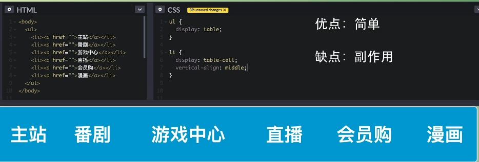
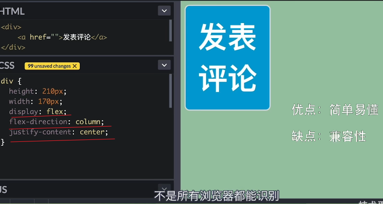
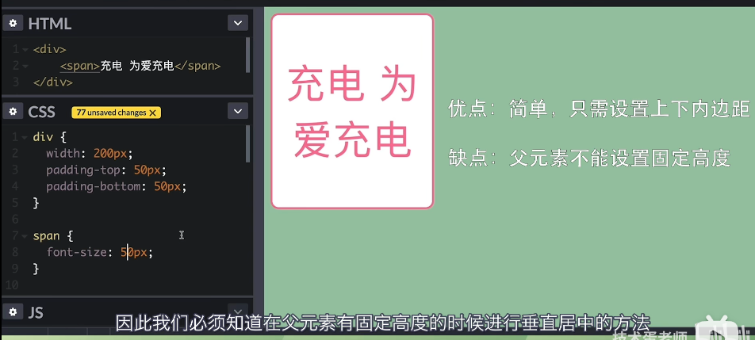
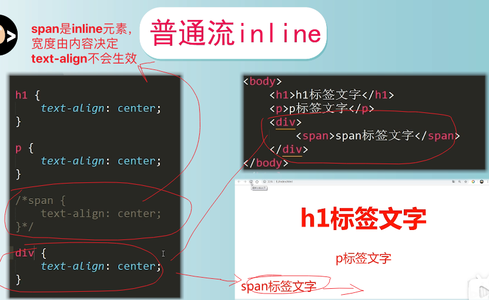
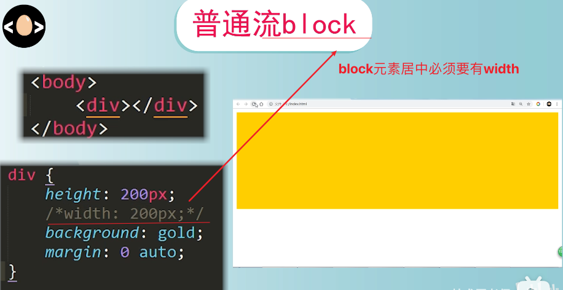
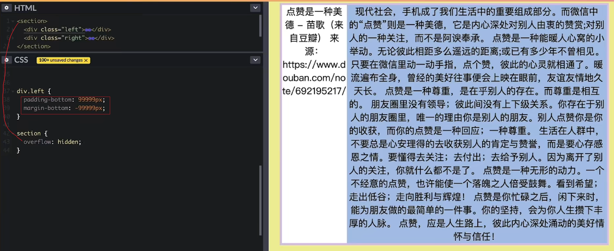
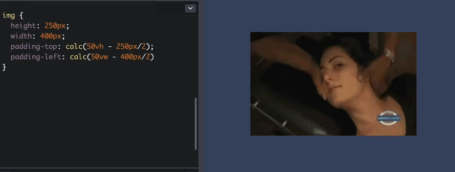
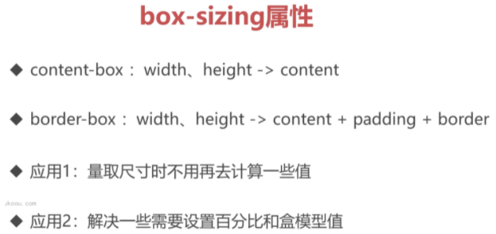

# HTML-snippet


# CSS-snippet
## 清除浮动clearfix(高度塌陷的父元素食用)，以及解决外边距合并
```css
.clearfix::after,
.clearfix::before {
  content: '';
  display: table;
  clear: both
}
```
- display: flow-root，不支持Safari。它可以创建无副作用的BFC。在父级块中使用 display: flow-root 可以创建新的BFC。其作用和clearfix一致。
- display: flow-root似乎还解决了margin-top外边距塌陷的问题

## 解决margin-top传递现象
  - 子元素改用padding-top
  - 父容器添加border-top: 1px solid transparent

## 方形切角效果 子绝父相
```css
&__tag {
    position: relative;
    /* 父元素宽 */
    width: 155px;
    height: 72px;
    background: #f34949;
    margin: 0 auto;
  }
  &__tag-cut {
    position: absolute;
    bottom: 0;
    /* 父元素宽度一半 */
    border-left: 78px solid transparent;
    border-right: 78px solid transparent;
    /* 10px指切角高度 */
    border-bottom: 10px solid #fff;
  }
```


# 垂直居中
1. 子绝父相 子元素垂直居中
    ```css
    {
      position: absolute;
      top: 50%;
      left: 50%;
      transform: translate(-50%, -50%);
    }
    ```
2. ul li table表格
   
3. flex 除开兼容性，最适合
   
4. grid 比较适合多行多列
   
5. 伪元素 vertical-align: middle
   
6. 父元素设置上下padding
   
7. line-height
   
# 水平居中
1. text-align: center
   
   
2. float浮动
   
## 等高布局
1. display: table
   
2. flex
   
3. grid
   
4. 兼容写法
   
## calc()应用场景
1. 图片垂直水平居中
   
2. 最小外边距
   
3. 两栏布局
   
## 单行溢出文本省略号
```css
{
  text-overflow: ellipsis;
  overflow: hidden;
  white-space: nowrap;
}
```

## 上下左右 箭头 >
```
<i class="arrow-down"></i>
.arrow-down{
  display: inline-block;
  border: 1px solid #000;
  border-width: 0 1px 1px 0;
  padding: 5px;
  <!-- -135上, 45下, 135左, -45右 -->
  transform: rotate(45deg);
}
```
## 圆点导航ul-li实现
```css
<ul>
	<li><a href=""></a></li>
	<li><a href=""></a></li>
	<li><a href=""></a></li>
</ul>

li {
	margin-left: 10px;
	list-style: none;
	float: left;
	width: 10px;
	height: 10px;
	background: #999;
	border-radius: 50%;
}
```

## 图片水平居中 - img { margin: 0 auto}不生效
- img是inline元素
```
img { display: block}
```

## BFC触发条件
- float的值不是none
- position的值不是static或者relative
- display的值是inline-block、table-cell、flex、table-caption或者inline-flex
- overflow的值不是visible
>在现代布局flex和grid中，是默认自带BFC规范的，所以可以解决非BFC盒子的一些问题，这就是为什么flex和grid能成为更好的布局方式原因之一。

## box-sizing

