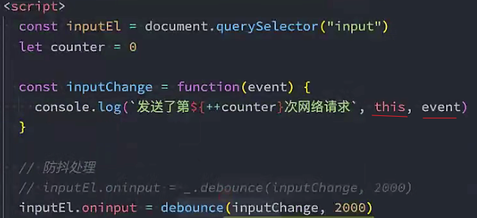

### debounce防抖函数

```js
function debounce(fn, delay) {
	// 定义一个定时器，保存上一次的定时器
	let timer = null
	// 实际执行的函数
	const _debounce = function(...args) {
		if(timer) {
			clearTimeout(timer)
		}
		// 延迟执行
		timer = setTimeout(() => {
			// 外部传入的执行函数
			fn.apply(this, args)
		}, delay)
	}
	return _debounce
}
```

```js
function throttle(fn, interval) {
  // 记录上一次的开始时间
  let lastTime = 0
  // 事件触发时，实际执行的函数
  const _throttle = function() {
    // 获取当前事件触发的时间
    const nowTime = new Date().getTime()
    // 使用当前触发的时间和之前的时间间隔以及上一次开始的时间，计算还剩多长时间触发函数
    const remainTime = interval - (nowTime - lastTime)
    if(remainTime <= 0) {
      // 实际触发的函数
      fn()
      // 保留上次触发的时间
      lastTime = nowTime
    }
  }
  return _throttle
}
```