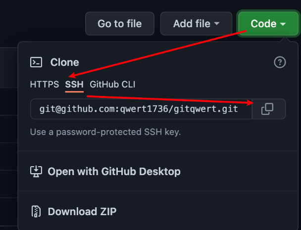
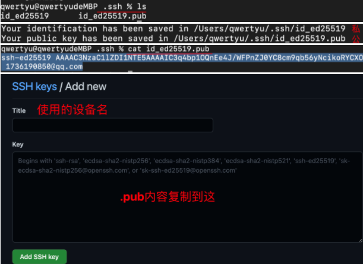

# Git和github基本使用

```
找开源项目的一些途径
• https://github.com/trending/
• https://github.com/521xueweihan/HelloGitHub
• https://github.com/ruanyf/weekly
• https://www.zhihu.com/column/mm-fe

特殊的查找资源小技巧-常用前缀后缀 
• 找百科大全 awesome xxx
• 找例子 xxx sample
• 找空项目架子 xxx starter / xxx boilerplate 
• 找教程  xxx tutorial
```
### 基础配置
```
git config --global user.name “你的用户名”
git config --global user.email “你的邮箱”
git config --list --global
```
### 初始化
```
cd 目录
git init
```

### 基本命令
```
* 暂存所有未跟踪的文件（工作区->暂存区）
git add .

单一文件
git add 文件名

* 提交且描述
git commit -m "xxx"
提交过的文件再次修改，快速提交
git commit -am "xxx"
提交且修正上一次描述
git commit --amend

* 撤销工作区文件的编辑操作(所有文件.)
git checkout 文件名.后缀

* 撤销暂存区文件提交（git add之后的, 未commit的文件，暂存区->工作区）
git reset 文件名.后缀

* 撤回当前仓库文件（git commit之后的文件, 仓库->暂存区）
git reset HEAD^

* 查看提交历史(默认显示最近一次修改，多次-n）
git log --stat
(q退出查看)
* log单行显示
git log --pretty=oneline
* log单行简化显示
git log --oneline

* 删除操作（删了文件同时git add了该修改，等待git commit）
git rm 文件名
*重命名操作（同时git add了该修改，等待git commit）
git mv 原文件名 新文件名

* 查看分支
git branch
* 查看每个分支最后一次提交
git branch -v
创建分支(当前分支基础创建, -b亦是)
git branch 分支名

* 创建分支并且指向一个历史版本
(通过hash,可配合git log --oneline）
git brance 分支名 hash值

* 创建并切换到该分支
git checkout -b 分支名
* 切换分支
git checkout 分支名
* 合并分支（一般master/main下操作）
git merge 分支名
* 放弃当前合并(如遇太多冲突无法处理)
git merge --abort
* 删除分支（-D 强制删除）
git branch -d 分支名

[v大版本,功能添加号,bug修复号]
* 标记版本(commit之后使用)
git tag v1.0.0 (git tag显示存在的tag)
本地推送指定tag到远程
git push origin 版本号
* 本地推送所有tag到远程
git push --tags
删除版本
git tag -d 版本号
* 删除远程tag的
git push origin --delete 版本号

远程拉取到本地
git pull
本地推送到远程
git push

比较仓库和工作目录
git diff

回退指定版本
git reset --hard #commit

查看原log记录（回退后常用）
git reflog --pretty=oneline

删除工作区和仓库文件
git rm -f 文件名

只删除仓库文件
git rm --cached 文件名

* 查看当前连接的远程仓库
git remote -v
删除当前连接的远程仓库
git remote rm origin
```
### 本地新建项目
```
echo "# ubweb" >> README.md
git init
git add README.md
git commit -m "first commit"
git branch -M main
git remote add origin https://github.com/qwert2622/xxx.git
git push -u origin main
```

### 本地已有git项目
```
git remote add origin git@github.com:qwert1736/xxx.git
git branch -M main
git push -u origin main
```
---
## ssh免密登录

1. cd ~/.ssh    mac下ssh默认目录
2. 终端生成密钥对（邮箱是github账户对应的）
如：
ssh-keygen -t ed25519 -C "1736190850@qq.com"
3.